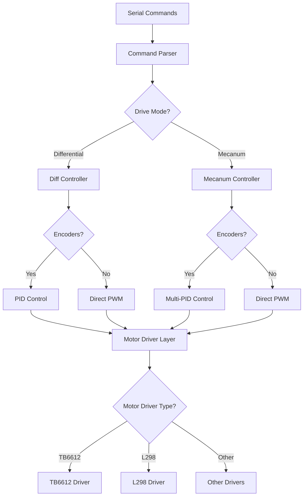

# Design Document

## Overview

This design extends the ROSArduinoBridge firmware to provide flexible motor control supporting multiple configurations: with/without encoders, differential/mecanum drive modes, and various motor drivers including TB6612. The architecture maintains backward compatibility while adding new capabilities through compile-time configuration flags.

## Architecture

### Core Design Principles

1. **Conditional Compilation**: Use preprocessor directives to include only necessary code
2. **Abstraction Layer**: Maintain consistent interfaces regardless of underlying hardware
3. **Modular Controllers**: Separate differential and mecanum control logic
4. **Graceful Degradation**: Operate without encoders when unavailable

### System Architecture Diagram



## Components and Interfaces

### 1. Configuration System

**File**: `ROSArduinoBridge.ino` (configuration section)

**Purpose**: Centralized compile-time configuration management

**Key Definitions**:
```cpp
// Drive mode selection
#define USE_MECANUM          // Enable mecanum mode
//#undef USE_MECANUM         // Enable differential mode

// Encoder configuration
#define NO_ENCODERS          // Disable encoder functionality
//#undef NO_ENCODERS         // Enable encoders

// Motor driver selection
#define SPARKFUN_TB6612      // Use TB6612 driver
//#define L298_MOTOR_DRIVER  // Use L298 driver
```

### 2. Enhanced Motor Driver Layer

**File**: `motor_driver.h` and `motor_driver.ino`

**Purpose**: Hardware abstraction for different motor drivers

**Key Functions**:
```cpp
void initMotorController();
void setMotorSpeeds(int leftSpeed, int rightSpeed);           // 2-motor differential
void setMecanumMotorSpeeds(int fl, int fr, int rl, int rr);   // 4-motor mecanum
void setMotorSpeed(int spd);                                  // Single motor (legacy)
```

**TB6612 Implementation**:
- Support for 2-motor configuration (left/right groups)
- Support for 4-motor configuration (individual control)
- Proper pin configuration and initialization
- Speed limiting and direction control

### 3. Encoder Abstraction Layer

**File**: `encoder_driver.h` and `encoder_driver.ino`

**Purpose**: Provide consistent encoder interface regardless of availability

**Key Functions**:
```cpp
long readEncoder(int i);
void resetEncoder(int i);
void resetEncoders();
void setEncoderDirection(int enc, int dir);

#ifdef NO_ENCODERS
// Stub implementations that return safe values
#endif
```

**Implementation Strategy**:
- When `NO_ENCODERS` is defined, all functions return 0 or perform no-ops
- When encoders are available, maintain existing functionality
- Support for multiple encoder types (Arduino pins, HC89, etc.)

### 4. Differential Drive Controller

**File**: `diff_controller.h`

**Purpose**: Control logic for 2-wheel differential drive robots

**Key Features**:
- Existing PID implementation (when encoders available)
- Direct PWM mode (when encoders disabled)
- Single target speed with left/right motor coordination

**Interface**:
```cpp
void resetPID();
void updatePID();
void doPID(SetPointInfo * p);

#ifdef NO_ENCODERS
void updateDirectDrive();  // New function for encoder-less operation
#endif
```

### 5. Mecanum Drive Controller

**File**: `mecanum_controller.h` (new file)

**Purpose**: Control logic for 4-wheel mecanum drive robots

**Key Features**:
- Omnidirectional kinematics
- Individual wheel PID control (when encoders available)
- Direct PWM mode for all wheels
- Twist command processing (vx, vy, wz → wheel speeds)

**Data Structures**:
```cpp
typedef struct {
  double TargetTicksPerFrame;
  long Encoder;
  long PrevEnc;
  int PrevInput;
  int ITerm;
  long output;
} MecanumWheelPID;

MecanumWheelPID wheelPID[4];  // FL, FR, RL, RR
```

**Key Functions**:
```cpp
void resetMecanumPID();
void updateMecanumPID();
void doMecanumPID(MecanumWheelPID * p);
void mecanumTwistToWheels(float vx, float vy, float wz, int* wheelSpeeds);
void updateDirectMecanum();  // For encoder-less operation
```

### 6. Command Processing Enhancement

**File**: `ROSArduinoBridge.ino` (runCommand function)

**Purpose**: Enhanced command processing for new capabilities

**New/Modified Commands**:
- `MOTOR_RAW_PWM`: Enhanced to handle 2 or 4 arguments based on drive mode
- `MECANUM_TWIST`: New command for omnidirectional velocity control
- `MOTOR_SPEEDS`: Modified behavior based on drive mode

**Command Processing Logic**:
```cpp
case MOTOR_RAW_PWM:
  lastMotorCommand = millis();
  resetPID();  // Disable PID when using raw PWM
  moving = 0;
  
  #ifdef USE_MECANUM
    // Parse 4 arguments: fl:fr:rl:rr
    setMecanumMotorSpeeds(arg1, arg2, arg3, arg4);
  #else
    // Parse 2 arguments: left:right
    setMotorSpeeds(arg1, arg2);
  #endif
  break;

case MECANUM_TWIST:
  #ifdef USE_MECANUM
    // Parse vx:vy:wz and convert to wheel speeds
    float vx = arg1 / 100.0;  // Scale factor
    float vy = arg2 / 100.0;
    float wz = arg3 / 100.0;
    int wheelSpeeds[4];
    mecanumTwistToWheels(vx, vy, wz, wheelSpeeds);
    setMecanumMotorSpeeds(wheelSpeeds[0], wheelSpeeds[1], wheelSpeeds[2], wheelSpeeds[3]);
  #endif
  break;
```

## Data Models

### 1. Motor Configuration Structure

```cpp
typedef struct {
  bool encodersEnabled;
  bool mecanumMode;
  int motorCount;
  int maxPWM;
} MotorConfig;
```

### 2. Mecanum Kinematics Parameters

```cpp
typedef struct {
  float wheelRadius;      // Wheel radius in meters
  float wheelBase;        // Distance between left and right wheels
  float trackWidth;       // Distance between front and rear wheels
  float gearRatio;        // Motor gear ratio
} MecanumParams;
```

### 3. PID Configuration

```cpp
typedef struct {
  int Kp, Ki, Kd, Ko;    // PID parameters
  bool enabled;          // PID enable/disable flag
} PIDConfig;
```

## Error Handling

### 1. Configuration Validation

**Compile-time Checks**:
```cpp
#if defined(USE_MECANUM) && !defined(SPARKFUN_TB6612)
  #error "Mecanum mode requires TB6612 motor driver or compatible 4-motor driver"
#endif

#if defined(NO_ENCODERS) && defined(USE_PID_CONTROL)
  #warning "PID control disabled due to NO_ENCODERS definition"
  #undef USE_PID_CONTROL
#endif
```

### 2. Runtime Error Handling

- Motor speed clamping to valid PWM range (-255 to 255)
- Graceful handling of invalid encoder readings
- Timeout protection for motor commands
- Safe fallback to stopped state on communication loss

### 3. Debug and Monitoring

**Debug Output** (optional compilation):
```cpp
#ifdef DEBUG_MOTOR_CONTROL
  Serial.print("Motor speeds: ");
  Serial.print(leftSpeed);
  Serial.print(" ");
  Serial.println(rightSpeed);
#endif
```

## Testing Strategy

### 1. Unit Testing Approach

**Motor Driver Tests**:
- Test each motor driver configuration independently
- Verify PWM output ranges and direction control
- Test initialization and shutdown procedures

**Controller Tests**:
- Test PID calculations with known encoder inputs
- Verify mecanum kinematics calculations
- Test encoder-less operation modes

### 2. Integration Testing

**Hardware Configurations**:
- Test with TB6612 in 2-motor mode
- Test with TB6612 in 4-motor mode
- Test with and without encoders
- Test differential vs mecanum modes

**Command Protocol Tests**:
- Verify all existing commands still work
- Test new mecanum-specific commands
- Test parameter parsing for variable argument counts

### 3. Regression Testing

**Backward Compatibility**:
- Ensure existing robot configurations continue to work
- Verify ROS2 integration remains functional
- Test that performance characteristics are maintained

### 4. Performance Testing

**Real-time Requirements**:
- Verify PID loop timing remains consistent
- Test command processing latency
- Measure memory usage impact of new features

## Implementation Notes

### 1. Memory Optimization

- Use conditional compilation to exclude unused code
- Minimize RAM usage for embedded environment
- Optimize data structures for Arduino constraints

### 2. Timing Considerations

- Maintain existing PID loop timing (30 Hz)
- Ensure command processing doesn't block PID updates
- Handle encoder reading timing requirements

### 3. Pin Configuration

- Provide clear pin mapping documentation
- Support configurable pin assignments
- Validate pin conflicts at compile time

### 4. Migration Path

- Provide configuration examples for common setups
- Document upgrade procedures from existing installations
- Maintain compatibility with existing ROS2 packages